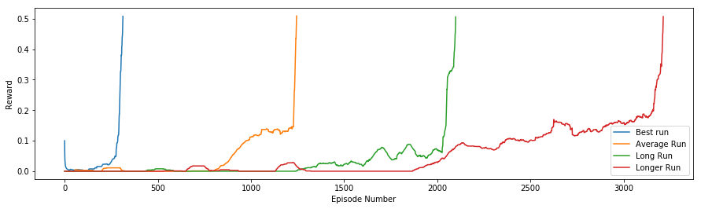
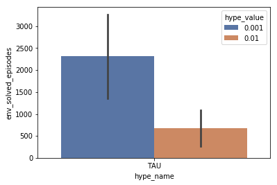
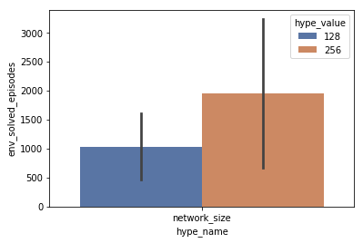

## Background

The goal was to solve an environment where two agents are learning to play tennis in a 2D environment<sup>1</sup>. The definition of "solved" was defined as "at least one agent can get a score of at least 0.5 over an average of 100 episodes". In this environment, each agent receives a 24d vector representing the state space. This state space describes the ball relative to the position of the racket. Each agent is fed a 2d action vector, representing the movements "forward/backwards" for the first dimension and "up/down" for the second dimension. A reward of +0.1 is given if an agent hits the ball over the net. A penalty of -0.01 is given if the ball touches the ground or the agent hits the ball out of bounds

## Algorithm

The environment was solved using a DDPG algorithm. The DDPG (Deep Deterministic Policy Gradient) algorithm uses an two networks - an actor to determine what action the agent should take given the state, and a critic to evaluate how good that action is given the state and action from the actor. There are two copies of the actor-critic networks - a local network that is constantly learning and comparing against the target network to compare the MSE for the actor and the TD error for the target. As the DDPG algorithm is an off-policy method, frames of an episode are stored in a ReplayBuffer and sampled during each iteration. A soft-update is applied to the target network to slowly update the target weights, by which a small percentage (~1%) of the local network's weights gets "blended" into the target network weights

## Methods

The DDPG algorithm implemented was based off the implementation provided in the [ddpg-pendulum](https://github.com/udacity/deep-reinforcement-learning/blob/master/ddpg-pendulum/) example. A few pieces were changed to account for the fact that two agents were playing at the same time. Since the action space for both agents are the same, one pair of actor-critic networks were used to control both networks. Thus, at each iteration, two frames were being generated and added to the ReplayBuffer, one for each agent. A hyperparameter search was used to determine which combination of parameters would result in the "best" solution, as defined by being able to solve the environment in the fewest number of episodes. The below hyperparameter space was searched:

```
{
    "LR_ACTOR": [1e-4],           # Learning rate of the actor
    "LR_CRITIC": [1e-3, 5e-4],    # Learning rate of the critic
    "GAMMA": [0.99],              # Discount factor for future rewards
    "TAU": [1e-2, 1e-3],          # How quickly should the target be upated
    "BUFFER_SIZE": [1e5, 1e6],    # How large of a buffer
    "BATCH_SIZE": [128],          # How many frames to sample at each learn() step
    "eps_decay": [0, 0.98],       # How much to decrease the noise being added to the actor
    "network_size": [128, 256],   # Size of the fully-connected actor/critic networks
    "seed_start": [2, 10]         # In case the seed matters
}
```

## Results

The best hyperparameters are below:
```
{
    "LR_ACTOR": 1e-4,           
    "LR_CRITIC": 1e-3,    
    "GAMMA": 0.99,              
    "TAU": 1e-3,          
    "BUFFER_SIZE": 1e5,    
    "BATCH_SIZE": 128,         
    "eps_decay": 0 0.98,       
    "network_size": 256,   
    "seed_start": 10
}
```

This set of hyperparameters solved the environment in 314 episodes.

### Rewards Over Time

A few sample hyperparameter runs for episodes vs rewards are shown below.



We can see that the environment can be solved in as few as 314 episodes. Though not shown, there were a handful of hyperparameter sets that were unable to solve the environment in fewer than 4000 episodes. The reward vs time graphs also reveal some intricacies about what the agent is learning. Specifically - for agents that take longer to converge, we notice a long period of no rewards - meaning that the agent has no idea about how to hit the ball. Once the agent learns how to hit the ball, reward starts picking up reasonably quickly. And once the agent gets a reward of 0.2, the environment is solved quickly thereafter - as a reward of 0.2 suggests that the agent can hit the ball back and forth at least twice.


### Hyperparameter Evaluation

By looking at the average differences between different hyperparameter spaces, a few things are noticed. 



A larger TAU - or updating the target networks to be closer to the local networks on average led to solving the environment in significantly fewer episodes with much lower variance across different hyperparameter sets. This intuitively makes sense, but increasing TAU too much can lead to potential divergence, so this is likely a carefully tuned parameter.



We also notice that a smaller network consistently led to solving the environment more quickly with a lower stddev across different hyperparameters. This also is in line with what we expect as networks with fewer parameters converge more quickly and generally have lower variance.


## Future Work

While there are other algorithms such as PPO or a continuous A3C that would be interesting to try, I would be curious to see if we could speed up training by changing the environment itself. Perhaps one reason that it takes a long time for the agent to learn how to hit the ball over the net is that the agent has no concept of when the ball is "on their side". By only training a network on frames in which the ball is on the agent's side, you reduce the amount of noise the agent sees. In addition, as DDPG is an off-policy method, we may be able to fill the ReplayBuffer up significantly faster by adding reflections, and thus allow the agent to train faster as more states are explored in a shorter period of time. Lastly, I would be curious to see if the reward function could be changed slightly to speed up training - and to perhaps have an "evolving" reward system. The first level reward could be perhaps "if the agent hits the ball, reward = +0.1" to promote the agent to learn just how to move the racket toward the ball. After the agent learns never to miss the ball, the reward can change to "+0.1 for hitting the ball over the net, and -0.01 if miss or out of bounds". This would be interesting as in the hyperparameter spaces that took the agent a long time to learn, there were extensive periods of "0" reward in which the agent just has no idea about how to hit the ball. 

Lastly, the hyperparameter search would run much more quickly if the training algorithm were to stop after a certain amount of reward or a certain number of frames, as I noticed a few of the last episodes hit the ball over 26 times before the episode ended!